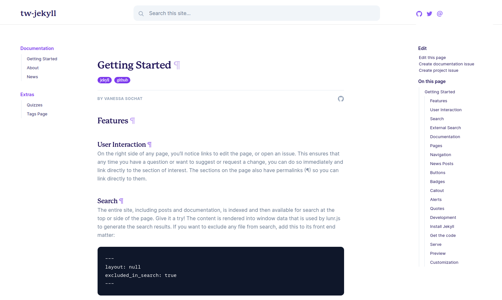

# Tailwind (tw) Jekyll



⭐️ [Documentation Demo](https://vsoch.github.io/tw-jekyll/) ⭐️

This is a [starter template](https://vsoch.github.com/tw-jekyll/) for a Tailwind jekyll theme, based
on [these docs](https://github.com/superfly/docs) that are based on [Tailwind css](https://tailwindcss.com/docs/installation),
however everything has been modified to work on GitHub pages (using Jekyll). If you don't need
native deployment on GitHub pages, then please consider checking out Tailwind. 
The original [Apache License](LICENSE) is included. I (@vsoch) have extended it to include:

- includes for callouts and badges
- rainbow buttons
- colored tags (with a tags page) for posts and articles
- GitHub interaction buttons to edit, open an issue, or ask a question
- customization of colors and minimal style
- CircleCI preview

And let me know if you'd like to add anything else, or just open a PR and contribute! 🔥️

## Usage

### 1. Get the code

You can clone the repository right to where you want to host the docs:

```bash
git clone https://github.com/vsoch/tw-jekyll.git docs
cd docs
```

### 2. Customize

To edit configuration values, customize the [_config.yml](_config.yml).
To add pages, write them into the [pages](pages) folder. 
You define urls based on the `permalink` attribute in your pages,
and then add them to the navigation by adding to the content of [_data/toc.myl](_data/toc.yml).
The top navigation is controlled by [_data/navigation.yml](_data/navigation.yml)

### 3. Options

Most of the configuration values in the [_config.yml](_config.yml) are self explanatory,
and for more details, see the [getting started page](https://vsoch.github.io/tw-jekyll/docs/getting-started)
rendered on the site.

### 4. Serve

Depending on how you installed jekyll:

```bash
jekyll serve
# or
bundle exec jekyll serve
```

**NOTE:** If the above serve command throws an error saying `require': cannot load such file -- webrick (LoadError)` try to run `bundle add webrick` to automatically add the webrick gem to your Gemfile, or manually add `gem "webrick"` line to the Gemfile and then run the serve command again.


### 5. Run as a container in dev or prod

#### Software Dependencies

If you want to run jekyll via a container for development (dev) or production (prod) you can use containers. This approach requires installing [docker-ce](https://docs.docker.com/engine/install/ubuntu/) and [docker-compose](https://docs.docker.com/compose/install/). 

#### Customization

Note that the [docker-compose.yml](docker-compose.yml) file is using the [jekyll/jekyll:3.8](https://hub.docker.com/r/jekyll/jekyll/tags) image. If you want to make your build more reproducible, you can specify a particular version for jekyll (tag). Note that at the development time of writing this documentation, the latest was tag 4.0.0,
and it [had a bug](https://github.com/fastai/fastpages/issues/267#issuecomment-620612896) that prevented the server from deploying.

If you are deploying a container to production, you should remove the line to
mount the bundles directory to the host in the docker-compose.yml. Change:

```yaml
    volumes: 
      - "./:/srv/jekyll"
      - "./vendor/bundle:/usr/local/bundle"
      # remove "./vendor/bundle:/usr/local/bundle" volume when deploying in production
```

to:

```yaml
    volumes: 
      - "./:/srv/jekyll"
```

This additional volume is optimal for development so you can cache the bundle dependencies,
but should be removed for production. 

#### Start Container

Once your docker-compose to download the base container and bring up the server:

```bash
docker-compose up -d
```

You can then open your browser to [http://localhost:4000](http://localhost:4000)
to see the server running.

> Node : changes `baseurl: ""` in _config.yml  when you are running in local and prod according to the requirement.
